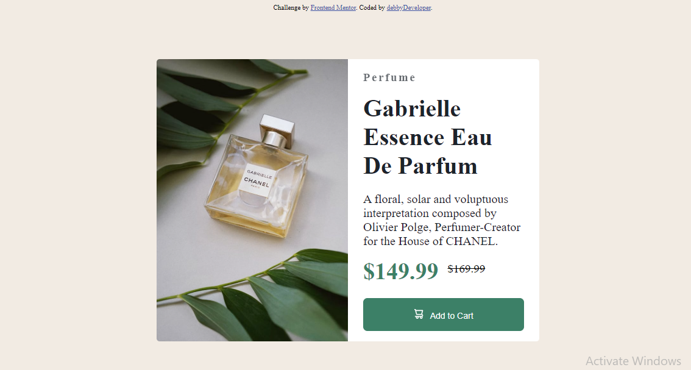

# Frontend Mentor - Product preview card component solution

This is a solution to the [Product preview card component challenge on Frontend Mentor](https://www.frontendmentor.io/challenges/product-preview-card-component-GO7UmttRfa). Frontend Mentor challenges help you improve your coding skills by building realistic projects. 

## Table of contents

- [Overview](#overview)
  - [The challenge](#the-challenge)
  - [Screenshot](#screenshot)
  - [Links](#links)
- [My process](#my-process)
  - [Built with](#built-with)
  - [What I learned](#what-i-learned)
  - [Continued development](#continued-development)
- [Author](#author)

## Overview

### The challenge

Users should be able to:

- View the optimal layout depending on their device's screen size
- See hover and focus states for interactive elements

### Screenshot

### Links

- Solution URL: [Add solution URL here](https://your-solution-url.com)
- Live Site URL: [Add live site URL here](https://your-live-site-url.com)

## My process

### Built with

- Semantic HTML5 markup
- CSS custom properties
- Flexbox

### What I learned

I learnt how to style and center images. I also made use of the position css property as well as flex.

### Continued development

This isn't perfect at all as i just started taking web development serious. This is one of my first projects. 
i'll have to study   and practice more on **CSS** properties. It's quite obvious, i had a lot of tough time styling this project. Your reviews are highly appreciated. Would help me do better as a self-taught and currently learning web developer.

## Author

- Frontend Mentor - [@Debby123](https://www.frontendmentor.io/profile/Debby123)
- Twitter - [@Ojoka_Deborah](https://www.twitter.com/Ojoka_Deborah)